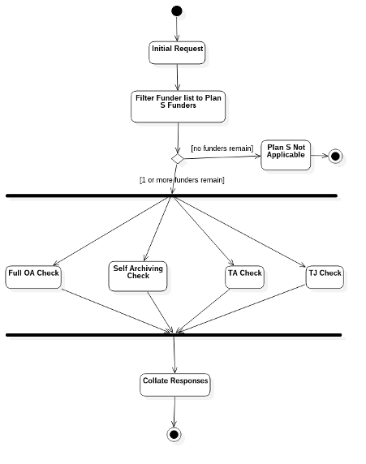

# How the Journal Checker Tool works

The Journal Checker Tool (JCT) is provided by cOAlition S to authors to support them in finding Plan S compliant "routes" through which to publish their articles. The tool allows an author to enter the name of a funder, an institution and the journal to which they plan to submit an article, and checks if this combination of funder, institution and journal offers any route to compliance with Plan S.

## Architecture

The JCT is divided into two components - a *backend* and a *frontend*.

**Back-end:** the back-end component harvests and [caches](#caches) data from a number of significant [data sources](#data_sources), handles search requests via an API, and executes several [algorithms](#algorithms) used to determine compliance with the Plan S policies. The back-end is designed in such a way that it may be used in other, third-party webservices as an [embeddable-plugin](#embeddable-plugin).

**Front-end:** the front-end component is the part that most users see, providing the search form and results screen, as well as documents such as FAQs etc.

## Data Sources

A number of data sources are used by the JCT to aid its calculation of Plan S compliance:

* [DOAJ (Directory of Open Access Journals)](https://doaj.org/)
* [Open Access Button](https://openaccessbutton.org/)
* [ESAC Agreement Registry](https://esac-initiative.org/about/transformative-agreements/agreement-registry/)
* [Crossref](https://www.crossref.org/)
* [ROR](https://ror.org)

## Caches

The data used in the JCT calculation is both very large (millions of records) and distributed across the global network. This means that, in order to maintain a good level of performance, the JCT operates a set of local caches of some of this data. These caches are "refreshed" according to the schedule below. Refreshing the caches picks up new records as well as updates to existing records.

<mark>TODO: cache update schedule</mark>

## API

The API to the the back-end component of the JCT is used by the front-end component, as well as by the [embeddable plugin](#embeddable-plugin). This API is also made openly available so that others may use it directly. The API is [documented here](/apidocs).

## Embeddable Plugin

<mark>TODO: LINK AND DESCRIPTION</mark>

## Algorithms

The JCT makes its calculations according to a defined algorithm.

### Inputs

A request against the compliance algorithm (such as via the Web API) can provide the following constraining parameters:

| **Parameter** | Cardinality | **Data type** |
| ------------- | ----------- | ------------- |
| Journal       | 1           | ISSN          |
| Funder        | 0..*        | CrossRef ID   |
| Institution   | 0..*        | ROR ID        |

Note that both Funder and Institution are not strictly required for the algorithm to execute. This is because there are compliance routes documented here which do not *require* either Funder or Institution. Nonetheless, Funder and Institution data is essential to give the user a complete picture of the compliance space for their context. The algorithm is specified to allow these *partial* queries in order to allow us to build predictive or reactive responses to users as they start to assemble their queries via the UI.

### Outputs

The output of the algorithm consists of a set of 4 or more compliance analyses for the various input combinations. Each of these analyses contains:

* The ISSN of the Journal the analysis refers to
* The Crossref IDs of the Funders the analysis refers to
* The ROR IDs of the Institutions the analysis refers to
* The compliance route for which this answer is relevant
* Whether this analysis determines the set of Funder, Institution and Journal here to be compliant. One of 3 possible outcomes is available:
  * *Compliant* - the algorithm has determined that the input would comply with Plan S at the time the query was executed
  * *Non-Compliant* - the algorithm has determined that the input does not comply with Plan S at the time the query was executed
  * *Unknown* - there was insufficient information in the data source(s) to determine whether the input complies with Plan S or not at the time the query was executed
* Qualifications for compliance - any guidance that the user needs to understand their compliance result in the context of the query.
* An audit trail for the decision - a record of the checks that took place in order to come to this conclusion

There will be no attempt to indicate a priority or preference for any compliance route, as the best route to compliance may be different per user.
Note also that the presence of 4 or more results does not imply that all these results need to be shown to the user. It will be up to the UI and the API to decide whether they expose Non-Compliant/Unknown results, and if so in what way.